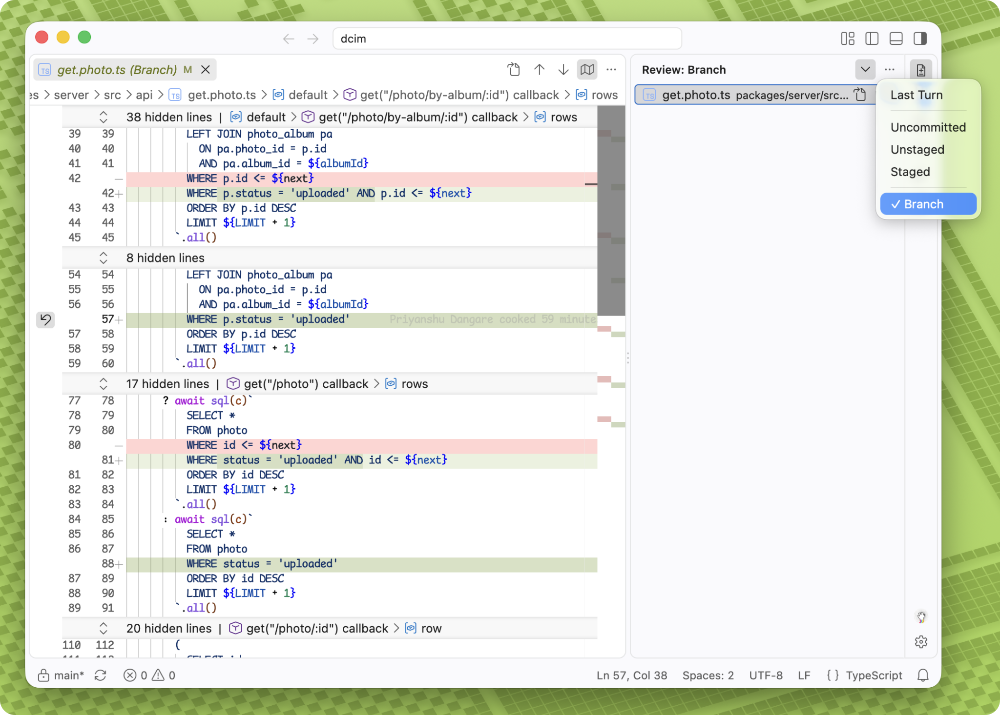

# VSVibe

**A focused home for code review in VS Code.**

Bring a Codex-style review workflow into your editor. See what changed in your branch, your working tree, or the latest completed Codex turn, then jump straight into the diff.



## Review the changes that matter

- **Choose your scope.** Switch between Branch, Uncommitted, Staged, Unstaged, and Last Turn from one dropdown.
- **Review the latest Codex turn.** Compare against the recorded baseline while keeping the working file live and editable.
- **Open the whole review.** Click the eye icon to open every diff in its own kept-open tab. Clean editor tabs are closed first; editors with unsaved changes stay open.
- **Browse your way.** Use a compact list or folder tree, sort by name or status, and see the file count on the activity bar.
- **Stay in context.** Changes update in the background while the current list stays visible. Click a file to preview its diff or open it directly for editing.

## Install

Requires VS Code 1.110 or later, Git, Node.js 24 or later, and pnpm. Make sure the `code` command is available in your terminal.

```sh
git clone https://github.com/aspizu/vsvibe.git
cd vsvibe
pnpm install --frozen-lockfile
pnpm package --out dist/vsvibe.vsix
code --install-extension dist/vsvibe.vsix --force
```

Open a Git project in VS Code, select **Review** in the activity bar, and choose a scope. **Last Turn** uses local Codex session history.
