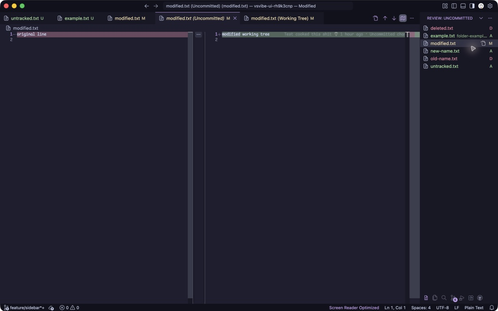
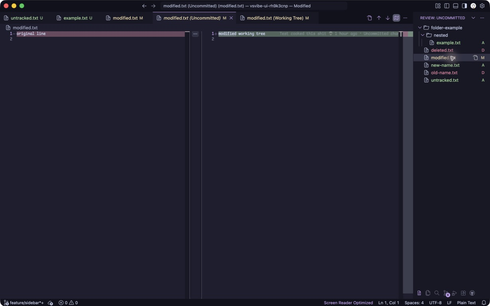

# vsvibe

vsvibe aims to turn VS Code into an AI code reviewing tool, with reviewing changes as the primary workflow.

Today, the Review sidebar brings your file changes together so you can inspect them in one place.

Open **Review** and select a file to see its diff. Use the **Open File** button beside an entry to open the file directly.

Choose what to review from the scope dropdown:

- **Branch**: changes on your branch, including uncommitted edits.
- **Uncommitted**: all changes you haven’t committed yet.
- **Unstaged**: changes you haven’t staged yet, including new files.
- **Staged**: changes ready for your next commit.

Use the three-dot menu to switch between a flat list and a folder tree, or refresh manually. Review updates automatically as you save files and change their Git status, and remembers your scope and layout for each workspace.

Review changes in a flat list and open a diff beside it.

Switch to a folder tree to see where each changed file belongs.

